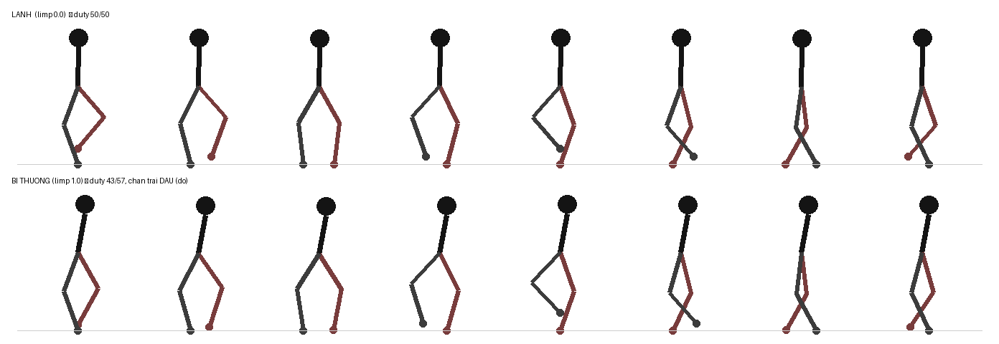

# Hệ Animation Stickman — ba tầng, không có Animator Controller

> Code: `Assets/Scripts/Core/Rig/`, `Assets/Scripts/Combat/Rig/StickmanProceduralAnimator.cs`,
> `Assets/Scripts/Combat/Rig/StickmanBodyAnimator.cs`, `Assets/Scripts/Combat/Rig/StickmanLegWalker.cs`
> Tool: `Tools > Stickman > Animation` · Dữ liệu: asset `StickmanActionSet`
> Sân tập thử mọi động tác: `Demo_12_Traversal`

## 0. Vì sao dự án này KHÔNG dùng Animator Controller + clip

Rig stickman animate **IK target**, không xoay từng khúc xương (xem AGENTS.md mục 2).
Một tư thế vì vậy chỉ là vài con số — đặt 4 IK target + 2 góc là xong cả người. Nên thay vì
bake clip rồi dựng state machine, dự án **lerp thẳng giữa các pose lúc chạy**:

| Được | Vì |
|---|---|
| Thêm động tác = thêm DỮ LIỆU | không đụng Animator Controller, không sinh file .anim |
| Trộn được nhiều tầng | tay đang cầm vũ khí vẫn ngồi/nhảy được, không cần layer + mask |
| Đổi skin không vỡ | pose chân ghi bằng OFFSET so với tư thế nghỉ của chính rig đó |
| Chạy theo TỐC ĐỘ THẬT | bò/leo nhanh chậm theo vận tốc, không phải chỉnh `speed` của clip |

`StickmanAnimationRecipe` (bake ra .anim thật) vẫn còn — dùng khi cần clip cho thứ khác
(cutscene, Timeline). Còn nhân vật lúc chơi thì đi đường procedural.

## 1. BA TẦNG — ai sở hữu transform nào

Đây là luật quan trọng nhất của cả hệ. **Mỗi transform chỉ MỘT chủ.** Hai script cùng ghi
một transform trong `LateUpdate` thì nhân vật giật theo thứ tự script — lỗi rất khó lần ra.

```
StickmanProceduralAnimator   → IKArmL · IKArmR · góc boneHead · góc vũ khí     (TAY + VŨ KHÍ)
StickmanLegWalker            → IKLegL · IKLegR · góc body_1                    (BƯỚC ĐI)
StickmanBodyAnimator         → rig root (Bone) localPosition.y                 (CHIỀU CAO NGƯỜI)
```

`StickmanBodyAnimator` là tầng ĐỘNG TÁC TOÀN THÂN. Nó **không ghi thẳng IK nào cả** —
nó tính pose rồi **mượn** hai tầng kia qua API:

| API | Của ai | Dùng khi |
|---|---|---|
| `SetActionLegs(legL, legR, bodyAngle, weight)` | LegWalker | mọi động tác (chân luôn bị chiếm) |
| `ClearActionLegs()` | LegWalker | hết động tác, trả chân về bước đi |
| `SetActionArms(armL, armR, weight, headOffset)` | ProceduralAnimator | leo/đu dây/bò (tay phải bám) |
| `ClearActionArms()` | ProceduralAnimator | trả tay lại cho vũ khí |

`weight` 0→1 là độ đậm, nên động tác **blend vào/ra** chứ không bật tắt cứng.

Đổi từ động tác này sang động tác kia thì có **crossfade** riêng (`blendInTime`): nhớ tư thế
đang đứng rồi hoà dần sang tư thế mới. Thiếu nó thì chuỗi nhảy → rơi → tiếp đất cắt cứng
từng nhịp, vì lúc đổi clip `weight` vẫn đang là 1 nên tư thế mới áp trọn ngay frame đầu.

## 2. Dữ liệu một động tác

```
StickmanActionSet (asset)          bộ động tác của một nhân vật — đổi 1 ô là đổi cả bộ
└── StickmanActionClip[]           mỗi phần tử là MỘT STYLE của một loại
      type      Jump / Crouch / Hurt...   (StickmanActionType)
      style     "tuck" / "prone" / "army" — tên để gọi đích danh
      weight    trọng số lúc BỐC NGẪU NHIÊN (0 = không bao giờ tự bốc)
      loop      lặp mãi (ngồi/leo) hay chạy một lần (nhảy/trúng đòn)
      armMode   Keep (không đụng tay) / Blend (trộn nhẹ) / Override (chiếm hẳn)
      priority  động tác đang chạy chỉ bị cắt bởi priority CAO HƠN
      keys[]    { time, StickmanActionPose }
```

### Hệ toạ độ của pose — hai tay hai chân KHÔNG cùng hệ

- **Chân + thân: OFFSET so với tư thế nghỉ.** `+X` ra trước mặt, `+Y` co lên phía hông.
  Vị trí nghỉ thật trong rig: `IKLegL (0.46, -1.12)`, `IKLegR (-0.59, -1.10)`.
  Đi bằng offset nên **đổi skin / đổi tỉ lệ nhân vật là pose vẫn đúng**.
- **Tay: TUYỆT ĐỐI**, cùng hệ `WeaponHoldPose` — local của `boneHead`, **-Y là hướng ngắm**,
  `+X` là lên/ra sau. Tay buông tự nhiên ≈ `(-0.05, -1.0)`, giơ thẳng lên đầu ≈ `(1.5, -0.3)`.

### `bodyHeightOffset` — chỗ dễ sai nhất cả hệ

Muốn nhân vật NGỒI, phản xạ đầu tiên là kéo IK chân lên. Sai: làm thế là **chân co lên trời**
còn người vẫn đứng nguyên. Ngồi thật = **hông hạ xuống, bàn chân đứng yên**.

Nên `bodyHeightOffset` hạ **cả rig root** xuống `d`; IK chân — vốn là con của rig — tụt theo,
nên `StickmanBodyAnimator.ApplyPose` **bù ngược `|d|` vào IK chân** để bàn chân ở nguyên chỗ cũ.
Khoảng cách hông↔chân ngắn lại → **đầu gối tự co**. Đó mới là ngồi.

Nhân vật cao ~3 đơn vị rig (≈0.73 world): `-0.5` là ngồi xổm, `-1.0` là nằm bẹp sát đất.

### Góc lerp TUYẾN TÍNH, cấm `LerpAngle`

Giống hệt luật của `WeaponHoldPose.Lerp`: **đường đi là một phần của động tác**.
Cú lộn vòng ghi `bodyAngleOffset` 0 → 180 → 360; `LerpAngle` coi 0 và 360 là một điểm nên
nhân vật đứng im, mất sạch cú lộn. Muốn quay quá nửa vòng thì ghi góc liên tục, đừng wrap.

## 2b. ĐỘ MƯỢT — ba chỗ quyết định, và cả ba từng sai trong im lặng

Ba tầng của hệ này đều "đúng" khi đọc riêng từng đoạn, nhưng chỗ NỐI mới là chỗ mắt nhìn ra.

### 2b.1 Nội suy giữa hai khung — `StickmanActionClip.Sample`

| | cũ (`Smoothed`) | nay (`Spline`, mặc định) |
|---|---|---|
| Cách nối | `Mathf.SmoothStep` từng đoạn | Catmull-Rom **không đều**, đi xuyên qua mọi khung |
| Vận tốc ở khung giữa | **0** (dừng hẳn) | liên tục |
| `Jump/"tuck"` đo được | 0.1 °/s | 36.7 °/s |
| Vận tốc ĐỈNH | 60 °/s | 46.7 °/s (−22%) |

SmoothStep có đạo hàm bằng 0 ở **cả hai** đầu đoạn ⇒ mỗi khung là một lần đứng lại. Clip
trong dự án có 3–5 khung cách nhau 0.1–0.3 s, tức khựng 2–4 lần mỗi cú nhảy/đánh/trúng đòn.
Vận tốc đỉnh giảm vì không còn phải bù cho những lần dừng đó.

Ba chi tiết bắt buộc:
- **KHÔNG ĐỀU** — tiếp tuyến tính theo *mốc thời gian thật*, không theo chỉ số khung. Khung
  trong dự án cách nhau rất lệch (0.04 s nối 0.22 s); công thức đều thổi tiếp tuyến của đoạn
  ngắn lên nhiều lần và động tác vọt ra ngoài rồi giật ngược.
- **Clip lặp phải nối vòng qua chỗ nối** và nhận ra khung đầu **trùng** khung cuối (builder
  viết pose y hệt ở `t=0` và `t=duration`). Coi chúng là hai khung riêng thì tiếp tuyến ở
  chỗ nối bị dẹt ⇒ vẫn giật một nhịp **mỗi vòng lặp**, ở đúng chỗ nhìn lâu nhất.
- **`Spline = 0` là cố ý** — asset đã bake không có trường này trong YAML nên nạp
  `default(int)` = 0, tức asset cũ cũng mượt ngay mà chưa cần dựng lại.

### 2b.2 Đà vọt quá — `overshoot` + `StickmanActionClip.DefaultOvershoot(type)`

Cơ thể thật không dừng đúng điểm đến: nó đi lố rồi bị cơ kéo về. Bỏ nó thì động tác vẫn
ĐÚNG nhưng khô. Hai nhóm:

| nhóm | ví dụ | mức |
|---|---|---|
| Có lực | trúng đòn 0.26 · đấm 0.22 · cuốc 0.20 · tiếp đất 0.18 | vọt nhiều |
| Giữ lâu | đứng yên 0.05 · thủ 0.03 · **ngồi 0** | gần như không vọt |

Mức vọt **có trần theo biên độ của chính bốn khung quanh chỗ nối** — nhịp thở (biên độ
0.012) và cú lộn (360°) phải vọt theo tỉ lệ của mình. Trần này cũng là thứ giữ IK chân
trong tầm với; `ClampToReach` chỉ lo được TAY.

⚠ Bảng nằm **cạnh chính cái field** trong `StickmanActionTypes.cs`, vì dự án có HAI builder
ghi vào cùng một bộ động tác — bảng nào chỉ nằm một bên thì bên kia sai trong im lặng.

### 2b.3 Bước đi — `StickmanLegWalker`

`StrideFor` suy ra từ giả định bàn chân lùi **ĐỀU** trong pha trụ, nhưng `ComputeLeg` cũ vẽ
bằng `sin`: nhanh nhất ở giữa (hệ số π/2), chậm dần về hai đầu, trong khi thân đi đều.
Cộng cả bước thì bằng 0 — nên phép hiệu chuẩn vẫn báo *"khớp tuyệt đối 1.000×"*.

| | trượt đỉnh (% tốc độ thân) | gia tốc dọc đỉnh khi đặt gót |
|---|---|---|
| Đi bộ — cũ | 99.9% | 15 441 |
| Đi bộ — nay | **0.0%** | **49** |
| Chạy — cũ | 99.9% | 52 211 |
| Chạy — nay | **0.0%** | **164** |

- Pha trụ đi **tuyến tính** theo pha (`_groundLockedStance`) ⇒ bàn chân khoá chết vào đất.
- Pha đưa chân nối bằng Hermite có tiếp tuyến hai đầu **đúng bằng** tiếp tuyến pha trụ.
- Độ nhấc `max(0, cos)` → `sin²`: bỏ góc nhọn lúc đặt/nhấc gót (cái "cạch" nhìn ra thành
  bàn chân bị dập xuống đất).
- Mốc phát `Stepped` **không đổi** (phase = π/2 + kπ) ⇒ tiếng bước và bụi chân vẫn khớp.

Ba thứ làm bước đi "có người":

| | ở đâu | ghi chú |
|---|---|---|
| **Nhún hông** | `LegWalker.WalkBob` → `BodyAnimator` cộng vào rig root | LegWalker bù ngược vào IK chân ⇒ bàn chân đứng yên, gối co (cơ chế của tư thế ngồi) |
| **Lắc thân** | `_stepSway`, ô RIÊNG với `_lean` | nhét vào `_lean` là phép lerp đổi-kiểu-bước dập tắt nó |
| **Đánh tay** | `ProceduralAnimator.AddStepSway` đọc `LegWalker.ArmSwing` | chỉ dời IK tay, **không** động `weaponAngle` — nòng vẫn chỉ đúng mục tiêu |

⚠ Nhún hông phải **chốt một frame rồi mới đổi**: `BodyAnimator` (order −5) đọc trước,
`LegWalker` (order 0) bù sau. Tính lại từ pha MỚI là lệch một frame nhún ≈ 1/3 biên độ ⇒
bàn chân thọc xuống đất mỗi frame. Nhánh "động tác chiếm hẳn chân" phải **áp trước, tắt sau**.

⚠ Nhịp thở **nhường chỗ** khi đang đi — hai dao động cùng biên độ chồng nhau ra thứ nhìn
như tay run.

## 3. Bảng động tác dựng sẵn

Số liệu nằm trong CODE TOOL (sửa ở đó rồi bấm lại nút — gõ tay vào Inspector thì lần sau
dựng lại là mất sạch). **Hai file, hai vai trò, đừng lẫn:**

| File | Vai trò |
|---|---|
| `StickmanActionSetBuilder.cs` | dựng **4 BỘ theo tính cách** — Soldier · Heavy (khiên/búa) · Agile (sát thủ/cung) · Boss — từ 3 tham số `scale` (biên độ) · `speed` (nhanh chậm) · `weighty` (độ nặng). Mỗi loại một style CƠ BẢN. Đây là thứ `StickmanArchetype` gắn cho từng loại lính. |
| `StickmanActionBuilder.cs` | **kho STYLE PHỤ** — `AddExtraStyles()` nối thêm các kiểu khác vào cả 4 bộ, đã tự nhân theo `scale`/`speed` của bộ đó. Style trùng tên với bộ khung thì bỏ qua. |

Nên bộ Heavy lộn vòng thấp và chậm hơn bộ Agile, mà không phải chép bảng số 4 lần.
Chạy `Tools > Stickman > Animation > 1` là ra cả 4 bộ đã kèm style phụ.

| Loại | Style | Ghi chú |
|---|---|---|
| **Idle** | breathe · alert · tired | nhấp nhô rất nhẹ khi đứng yên |
| **Jump** | straight · tuck · star · flip | đều có pha NHÚN lấy đà trước khi bung — thiếu nó là cú nhảy mất lực |
| **Fall** | reach · flail | flail = quẫy tay chân, dùng khi bị hất văng |
| **Land** | soft · heavy · roll | rơi nhanh hơn `_hardLandSpeed` thì tự chọn `heavy` |
| **Crouch** | squat · kneel · prone | quỳ một gối hợp dáng bắn tỉa |
| **Crawl** | army · fourpoint | 2 tay chống đất (`armMode = Override`) |
| **ClimbIdle / Climb** | hold / ladder · wall | tay chân SO LE đúng cách người leo thật |
| **Rope** | hang · swing · shimmy | đu dây, lấy đà, chuyền tay |
| **Hurt** | flinch · stagger · gut · kneel | `blendInTime = 0`: trúng đòn phải giật NGAY |
| **HitImpact** | push · heavy | "hitstop bằng tư thế" ~0.1s khi đòn của mình ăn |
| **AttackBody** | lunge · plant · overhead · spin | chân LÙI lấy đà rồi BƯỚC TỚI — chỗ sinh ra lực của cú đánh |
| **Block** | brace · duck | tấn thủ (tay + vũ khí do `MeleeWeapon._guardPose` lo) |
| **Roll** | tumble · forward · sidestep | AI né đạn tự gọi cái này |

(Style in đậm ở cột giữa là của bộ khung; còn lại đến từ kho style phụ.)

**Nhiều style = mỗi lính một nết.** `StickmanBodyAnimator._randomStyleEveryTime`:
bật = mỗi cú nhảy một kiểu; tắt = mỗi nhân vật bốc một style lúc spawn rồi giữ nguyên
(nhìn quen mắt hơn, hợp nhân vật chính). Style có `weight = 0` thì **không bao giờ tự bốc**,
phải gọi đích danh — VD `Hurt/kneel` chỉ dùng khi máu ≤ 30%.

> **Lưu ý biên độ.** Bộ khung cố ý đi số NHỎ (ngồi = hạ hông ~0.11 rig unit ≈ 10% chiều dài
> chân) nên động tác kín đáo; style phụ đi số THẬT theo tỉ lệ rig (ngồi xổm 0.55 ≈ 50%,
> nằm bẹp 1.05). Chân dài ~1.11 rig unit, hông cao 1.26 — muốn nhìn rõ tư thế thì lấy
> mốc đó mà tính, đừng đoán.

## 4. Ai gọi động tác — phần lớn là TỰ ĐỘNG

`StickmanBodyAnimator` mỗi frame tự đọc trạng thái và chọn động tác nền:

```
IsClimbing  → Rope / Climb / ClimbIdle
IsAirborne  → Jump (đang lên) → Fall (qua đỉnh)
Stance      → Crouch / Crawl
IsGuarding  → Block
đứng yên    → Idle
đang đi     → (nhường hẳn cho StickmanLegWalker)
```

Động tác CHỚP NHOÁNG thì chen ngang theo `priority`, kích bằng sự kiện:

| Sự kiện | Nguồn | Động tác |
|---|---|---|
| `StickmanLocomotion.Jumped` | bật khỏi đất | Jump |
| `StickmanLocomotion.Landed(fallSpeed)` | tiếp đất | Land (nặng/nhẹ theo tốc độ rơi) |
| `StickmanController.Damaged` | trúng đòn | Hurt (máu ≤ 30% thì `kneel`) |
| `StickmanController.DealtHit` | **đòn của mình ăn** | HitImpact |
| `StickmanProceduralAnimator.AttackStarted` | vung vũ khí | AttackBody |

> **ĐỠ ĐƯỢC ĐÒN THÌ KHÔNG RÚM NGƯỜI.** `TakeDamage` vẫn bắn `Damaged` khi khiên/thế thủ
> chặn được (để thanh máu nhấp nháy), nên BodyAnimator phân biệt bằng **máu có tụt không** —
> đỡ được thì máu y nguyên, bỏ qua Hurt. Cái hay của việc đỡ nằm đúng ở chỗ đó.

Gọi tay từ script: `fighter.PlayAction(StickmanActionType.Roll)` hoặc
`fighter.PlayAction(StickmanActionType.Jump, "flip")`.

**AI cũng dùng được toàn bộ:** `StickmanAgent` gọi `Roll` khi né đạn, và `UpdateTraversal()`
tự nhảy qua khe / leo thang lên tầng có địch (xem `AI-NPC.md` §5.38) — động tác nhảy và leo
thì tầng này tự chọn theo trạng thái, AI không phải biết gì về animation.

## 5. Đi lại trong địa hình (`StickmanLocomotion`)

Mọi chuyển động vẫn đi qua **một chỗ duy nhất ghi vận tốc** — `FixedUpdate` của Locomotion.

### Nhảy

`Jump()` / `ReleaseJump()`. Có đủ ba thứ mà platformer nào cũng cần:

- **Coyote time** (`_coyoteTime` 0.1s) — vừa bước hụt khỏi mép vẫn nhảy được.
  Thiếu cái này là người chơi bấm đúng lúc rơi mà chẳng có gì xảy ra.
- **Jump buffer** (`_jumpBufferTime` 0.12s) — bấm sớm trước khi tiếp đất thì vẫn ăn.
- **Cắt đà khi thả phím** (`_jumpCutMultiplier`) — giữ lâu nhảy cao, nhấp nhẹ nhảy thấp.

`_maxJumps = 2` là có nhảy đúp. Mỗi cú nhảy tốn `_jumpStaminaCost` thể lực.

> **Đang bay thì KHÔNG chặn mép vực.** Luật chặn mép (`IsLedgeAhead`) chỉ áp khi đứng trên
> đất — không thì nhảy qua khe bị cắt đà giữa chừng và rơi thẳng xuống hố.

### Ngồi / bò

`SetCrouch(bool)` · `SetCrawl(bool)` · `SetStance(StickmanStance)`.
Tốc độ nhân `_crouchSpeedScale` (0.45) / `_crawlSpeedScale` (0.3).

### Leo thang / đu dây

`StickmanClimbZone` đặt trong scene (thang cứng hay dây mềm). Nhân vật `EnterClimb(zone)`:
tắt trọng lực, `Climb(±1)` đi dọc. Khác nhau ở phần ngang — **thang HÚT về đúng trục**,
**dây cho chuyền tay sang ngang**. Trèo vượt đỉnh thì tự buông kèm một cú hẩy nhẹ lên,
để người trèo hẳn lên sàn thay vì tụt lại.

Bám phải **BẤM MỚI BÁM** (W/S), không tự bám khi đi ngang — không thì lính đi tuần qua
cái thang là bị dính vào.

### Phím người chơi

| Phím | Việc |
|---|---|
| A/D · ← → | đi ngang |
| Shift | chạy (tốn thể lực) |
| **Space** | nhảy (giữ lâu = cao hơn) |
| **Ctrl** | ngồi |
| **C** | bò |
| **W/S** | leo thang / đu dây (bám và leo) |
| Chuột phải | thế thủ (xem WeaponSystem.md §4.3) |

## 5b. BỊ THƯƠNG — dáng đứng, tốc độ, và bước CÀ NHẮC

Dưới **30%** máu (hồi lên **38%** mới thôi — vùng chết) thì nhân vật đổi cả ba thứ cùng lúc.
Chủ của câu hỏi *"có đang bị thương không"* là **`StickmanController.IsWounded`**; hai người
đọc còn lại (`StickmanLocomotion`, `StickmanLegWalker`) KHÔNG tự đếm lại ngưỡng — ba chỗ tự
đếm là ba thời điểm khác nhau, và nhìn ra thành "lê chân trong khi dáng đứng vẫn hùng dũng".

| Vế | Ở đâu | Số ở lúc kiệt nhất |
|---|---|---|
| dáng ĐỨNG YÊN | `StickmanBodyAnimator.WoundedStyle` = `"tired"` | gập người thở dốc |
| TỐC ĐỘ | `StickmanLocomotion.WoundedScale` (ô riêng) | còn **55%** |
| chân ĐAU chống đất | `_limpDutyShift` | **43%** chu kỳ (chân lành 57%) |
| chân ĐAU nhấc lên | `_limpLiftDrop` | còn **32%** — lê sát đất |
| hông sụp ở nhịp chân đau | `_limpBobBoost` | sâu hơn nhịp kia **3.4 lần** |
| gập người | `_limpLean` | **+9°** |
| đánh tay | `_limpArmDamp` | còn **45%** |

`StickmanController.WoundedSeverity` chạy 0 → 1 (0 ở đúng ngưỡng 30%, 1 khi máu về 0) và mọi
số trên đều nội suy theo nó, nên không có cú giật nào ở lúc vừa chớm bị thương.

**Chân nào đau** bốc theo mã băm của chính nhân vật (một lần ở `Awake`), không bốc lại mỗi
lần bị thương — đổi chân giữa chừng là nhìn ra ngay, và cả tiểu đội cũng không cùng lê một bên.

### ⚠⚠ Hai chỗ đã suýt hỏng trong im lặng

1. **CÀ NHẮC KHÔNG ĐƯỢC LÀM BẰNG CÁCH RÚT SẢI CHÂN.** `StrideFor` hiệu chuẩn để bàn chân lùi
   ĐÚNG bằng quãng thân tiến tới (mục 2b); rút sải bên đau 20% là bên đó **trượt 20%**. Cách
   đúng là đổi **DUTY CYCLE** — phần thời gian bàn chân chạm đất — rồi bù biên độ theo
   `amp = 2 × duty`, nhờ đó `dforward/dp = −2/π` **bất kể duty**. Đo lại bằng Python: trượt
   đỉnh **0.00%** tốc độ thân ở mọi mức duty 0.40–0.60.
2. **NHÚN HÔNG LỆCH PHẢI DÙNG `Sin`, KHÔNG PHẢI `Cos`.** Nhún gốc `(1 − cos 2p)/2` cực đại ở
   `p = π/2, 3π/2` và bằng 0 ở `p = 0, π`; hệ số lệch viết bằng `−cos(p)` thì mạnh nhất đúng
   chỗ nhún gốc bằng 0 ⇒ nhân vào **thành 0**. Đo được: bản `Cos` cho hai nhịp chênh **1.00
   lần** (không lệch gì), bản `Sin` chênh **3.44 lần**.

Xem trước không cần Unity: `limp-preview.png` (cùng thư mục) — hàng trên lành, hàng dưới bị
thương, chân đỏ là chân đau. Ảnh dựng bằng chính công thức của `ComputeLeg`.



## 6. Thêm động tác mới

1. Thêm giá trị vào `StickmanActionType` (nối vào CUỐI, đừng chèn giữa).
2. Chọn chỗ viết:
   - động tác **cơ bản mọi nhân vật đều cần** → thêm vào `BuildSet()` của
     `StickmanActionSetBuilder.cs` (nhớ nhân `scale` / chia `speed`);
   - **thêm một kiểu khác** cho động tác đã có → viết hàm `AddXxxStyles` trong
     `StickmanActionBuilder.cs` rồi gọi trong `AddExtraStyles` (scale được áp tự động).
3. Chạy `Tools > Stickman > Animation > 1` để sinh lại 4 bộ.
4. Nếu là động tác NỀN (theo trạng thái) thì thêm vào `ResolveAmbientType()` +
   `IsAmbientClip()`; nếu là động tác theo SỰ KIỆN thì gọi `Play(...)` từ chỗ phát sự kiện.
5. Xem lại bằng mắt trong **Xưởng động tác** (mục 6b) — style mới mà không nhìn thấy thì coi như
   chưa thêm.

## 6b. XƯỞNG ĐỘNG TÁC — xem lần lượt từng clip của một nhân vật

`Demo_67_AnimLab` · nút «Xưởng ĐỘNG TÁC (Demo_67)» ở Bảng điều khiển › Động tác · Effect · Tiếng
(hoặc `Tools > Stickman > Nâng cao > Animation > 7`). Code: `StickmanAnimationViewer.cs` (runtime)
+ `StickmanAnimationLabBuilder.cs` (dựng scene).

Dùng thế nào:

1. Bấm nút → tool dựng scene, tự quét MỌI `StickmanArchetype` và MỌI `StickmanActionSet` đang có
   trên đĩa (không gõ tay bảng nào, nên thêm bộ mới là nó tự có mặt sau lần bấm kế).
2. Play. Trục **Nhân vật** (`[` `]`) đổi người; trục **Động tác** (`←` `→`) đi hết từng clip.
   `SPACE` chạy lại · nút «Tự chạy» đi hết bộ không cần bấm · nút `1× / 0.5× / 0.25×` quay chậm.
3. Bảng trái ghi số của clip đang xem (khung · thời lượng · lặp · ưu tiên · trọng số · armMode ·
   `legWeightWhileMoving` · `overshoot` · nội suy) và **đường dẫn asset** của bộ.
4. Sửa: đổi bảng số trong builder → «Dựng bộ ĐỘNG TÁC» → quay lại xưởng bấm ⟲ (nạp lại). KHÔNG gõ
   tay vào Inspector của asset — asset là bản BAKE, lần dựng sau ghi đè sạch.

Ba dòng cảnh báo của xưởng (cùng nội dung với Doctor nhóm động tác, xem `StickmanDoctor.Animation.cs`):

| Dòng | Nghĩa | Chữa |
|---|---|---|
| `CHƯA CÓ (n loại)` | loại động tác chưa có style nào trong bộ này | đây chính là danh sách việc cần THÊM |
| `n clip KHÔNG BAO GIỜ chạy` | clip rỗng khung, hoặc trùng cặp (loại, style) — `Pick` trả cái đầu tiên | đổi tên style / thêm khung rồi dựng lại |
| `⚠ ĐANG CHẠY: X` | `Play` từ chối clip vừa chọn (ưu tiên của clip đang chạy cao hơn) | không phải lỗi của bộ; đợi clip cũ xong hoặc bấm lại |

⚠ Style **XOAY TRỌN VÒNG** chỉ xem được ở đây: `StickmanActionSet.Pick` cấm bốc ngẫu nhiên chúng
(mục 5d của luật), nên trong trận không có đường nào thấy. Xưởng gọi đích danh tên style.

⚠ Xưởng KHÔNG gắn `StickmanShowcasePose` (tủ kính art dùng cái đó): hai chỗ cùng gọi `Play` là
clip đang soi bị cắt ngang giữa chừng mà không có gì nói vì sao.

Sân tập `Demo_12_Traversal` (`Animation > 6`) vẫn là chỗ thử động tác **trong lúc chơi thật** —
nhảy qua khe, leo thang, bò. Hai chỗ trả lời hai câu khác nhau: xưởng hỏi *"clip này trông thế
nào"*, sân tập hỏi *"nó có hợp với lúc đang đi lại không"*.

## 7. Những chỗ dễ sai

1. **Đừng ghi thẳng IK từ script mới.** Mượn qua `SetActionLegs` / `SetActionArms`.
   Ba script cùng ghi một transform là nhân vật giật theo thứ tự script.
2. **Ngồi = hạ rig root, không phải kéo chân lên** (xem §2).
3. **`LerpAngle` giết mọi động tác quay quá nửa vòng** — pose lerp tuyến tính.
4. **`blendInTime = 0` cho Hurt.** Blend mượt lúc trúng đòn là mất sạch cảm giác bị đánh.
5. **Bò/leo phải chạy theo TỐC ĐỘ** (`SpeedDrivenTimeScale`), không theo đồng hồ — không thì
   tay chân quạt lia lịa trong khi người nhích từng tí.
6. **Động tác nền không được cắt động tác chớp nhoáng.** `priority` lo việc đó:
   Hurt 70 > Roll 55 > Land 45 > Jump 40 > HitImpact 35 > Fall 30 > AttackBody 25 >
   Block 20 > Climb/Rope 15 > Crawl 12 > Crouch 10 > Idle 0.
   Ưu tiên là thuộc tính của **LOẠI**, không phải của từng style — `NormalizePriorities()`
   trong builder ép mọi style cùng loại về cùng một mức. Để mỗi style một số thì câu hỏi
   "X có cắt được Y không" đổi theo lần bốc ngẫu nhiên: cùng một cú đánh, lúc có dáng thân
   lúc không.
7. **Mọi clip `loop = true` PHẢI nằm trong `IsAmbientClip`.** Clip lặp thì không bao giờ
   "chạy xong", nên nếu nó không được coi là động tác nền thì `Play()` bảo vệ nó vĩnh viễn —
   nhân vật kẹt cứng ở tư thế đó tới lúc chết.
8. **Góc quay trọn vòng phải cắt vòng nguyên khi nhả.** Cú lộn kết ở 360° mà 360 ≡ 0 về hình
   ảnh; lúc `weight` tụt 1→0, góc bị nhân với weight nên chạy ngược 360 → 0, nhân vật xoay
   ngược trọn vòng ngay sau khi tiếp đất (`StickmanLegWalker` trừ vòng nguyên ở cả hai biến
   cùng lúc nên không giật hình).
9. **Pose tay là toạ độ TUYỆT ĐỐI, (0,0) là cái CỔ.** Nhân vật chưa từng cầm vũ khí thì
   `_basePose` rỗng = hai tay tụt vào gáy — `StickmanProceduralAnimator.SeedRestPose()` gieo
   tư thế nghỉ thật của rig một lần lúc dựng để tránh đúng chuyện đó.
10. **Vẽ chuyển động phải hỏi `TravelSpeed`, KHÔNG phải `Velocity`.** `Velocity` là vận tốc
    ta vừa GHI VÀO Rigidbody ("muốn đi nhanh thế này"); bị đồng đội chắn đường hay tì vào
    tường thì Box2D chặn lại, nhưng nhịp sau ta lại ghi đè đúng con số cũ nên nó vẫn báo
    đang chạy phăng phăng → **chân quạt tại chỗ trong khi người đứng im**.
    `StickmanLocomotion.TravelVelocityX/Y` đo quãng đường THẬT giữa hai nhịp vật lý —
    bước chân (`StickmanLegWalker`) và nhịp bò/leo (`SpeedDrivenTimeScale`) đều dùng nó.

11. **Chết là tắt component** — `DisablePerFrameScripts` trong `StickmanFighterController.OnDeath`
    tắt luôn BodyAnimator; xác dùng ragdoll, không cần động tác.

## Nguồn

- Nguyên tắc squash & stretch, anticipation (nhún trước khi nhảy), follow-through:
  12 nguyên tắc hoạt hình cổ điển của Disney.
- Coyote time / jump buffer / variable jump height: bộ ba chuẩn của platformer 2D
  (Celeste, Hollow Knight và hầu hết game nền tảng hiện đại đều có).
- Cách leo thang tay-chân so le: quan sát chuyển động leo thật, cũng là cách các game
  side-scroll cổ điển thể hiện.

## Hai vế procedural mượn từ tutorial "2D aim animation"

Tham khảo một tutorial procedural aim 2D (6 bước: ghép sprite rời → nhịp thở → xoay tay+súng
theo con trỏ → **ngả thân theo hướng ngắm** → đổi sprite áo theo hướng → tóc verlet). Dự án đã
có sẵn bước 1 và 3 (`boneHead` xoay theo hướng ngắm, hai tay treo dưới nó nên đi theo — cùng
kiến trúc). Hai vế còn thiếu đã bổ sung:

### 1. NGẢ THÂN THEO HƯỚNG NGẮM (`StickmanLegWalker.SetAimLean`)

Trước đây chỉ `boneHead` xoay theo hướng ngắm, còn THÂN đứng như cột — chĩa súng thẳng lên
trời vẫn ra một cái thân thẳng đơ với hai tay bẻ ngược lên. Nay ngắm lên thì vai ngả ra sau,
ngắm xuống thì gập người tới (`_aimLeanAmount` 11°, `_aimLeanSpeed` 7).

Ba luật đi kèm:
- **Ghi qua `StickmanLegWalker`, không ghi thẳng `body_1`** — component đó là chủ sở hữu duy
  nhất của góc thân. `StickmanProceduralAnimator.SetAim` chỉ ĐƯA VÀO, cùng khuôn `SetActionLegs`.
- **CỘNG vào độ ngả của bước đi, không thay thế** — đang chạy mà ngắm lên thì vừa chúi tới vì
  chạy vừa ngửa ra vì ngắm; hai lực đó có thật và triệt tiêu nhau. Thay thế là mất hẳn dáng
  chạy mỗi khi giương súng.
- **Động tác toàn thân vẫn thắng** — `_actionWeight` càng cao thì phần ngả do ngắm càng nhường
  lại, không thì đang lộn vòng vẫn cố ngửa người theo con trỏ.
- ⚠ Đổi góc world sang độ chúc/ngước phải SOI GƯƠNG khi quay trái, không thì ngắm lên mà thân
  chúi xuống. Đang bám thang thì hướng ngắm vốn đã bị ép về ngang → độ ngả tự bằng 0.

### 2. NHỊP THỞ (`StickmanProceduralAnimator.AddBreathing`)

Một cây súng ĐỨNG IM TUYỆT ĐỐI trông như ảnh chụp. Nay IK hai tay + góc vũ khí dao động rất
nhẹ (0.045 rig unit · 1.1°, ~17 nhịp/phút).
- Đặt ở `StickmanProceduralAnimator` chứ KHÔNG ở rig root: rig root là của
  `StickmanBodyAnimator`, còn IK tay + góc vũ khí là của chính nó → không tranh transform với ai.
- **Hai trục LỆCH TẦN** (1× và 0.5×) để mũi vũ khí vẽ hình số 8 chứ không đi lên xuống theo
  đường thẳng — cùng lý do ngọn lửa dùng tổng ba sin lệch tần.
- **Mỗi nhân vật một PHA riêng** (gieo 1 lần lúc thở nhịp đầu) — cả tiểu đội thở cùng nhịp thì
  nhìn như một khối máy.
- ⚠ Đang RA ĐÒN hoặc động tác toàn thân đang mượn tay thì KHÔNG thở: cộng dao động vào giữa cú
  vung là đòn đánh bị rung.

Cả hai đều có công tắc tắt (`_aimLeanEnabled`, `_breathing`) — tắt là hành vi cũ y hệt.
